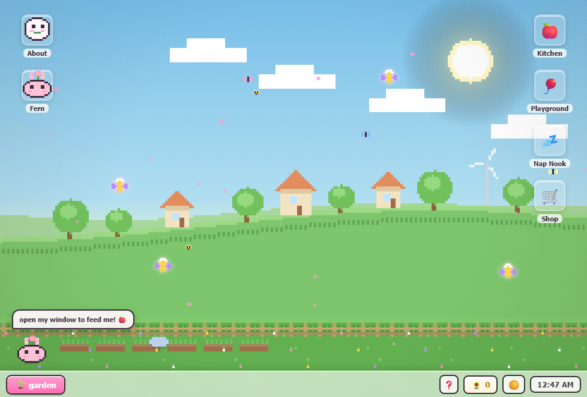

# 🌱 GardenOS

A cozy **solarpunk pet-and-garden game** styled as a tiny pixel desktop OS. Design your own
**Sproutling** — a little garden spirit — then keep it happy: feed it treats you grew yourself,
play with it, tuck it in, and decorate the garden you share.

## ✨ What's inside

- **🐣 Sproutling creator** — pick its shape, crown, and colors, then name it. It's yours.
- **📊 Real-time care** — hunger, happiness & energy drift over *actual elapsed time*, even while
  you're away. Energy refills overnight while it sleeps.
- **Care apps**, each its own little desktop window:
  - 🍎 **Kitchen** — harvest your garden's blooms into a pantry, then feed them as treats
    (every Sproutling has a favourite!)
  - 🎈 **Playground** — a bubble-pop mini-game that raises happiness (and costs energy)
  - 💤 **Nap Nook** — tuck it in and watch energy refill
- **🌷 Garden** — plant 8 flower types on the desktop; they sprout, grow and bloom over real
  minutes. Water them so they don't wilt.
- **💰 Economy** — harvesting earns **🌻 sunseeds**; spend them in the **Seed Shop** on crowns
  for your Sproutling and garden decor (the firefly lantern glows at night). Drag decor
  anywhere in your garden.
- **🕐 A living world** — the scene follows your real clock: bright mid-day, golden dusk, starry
  night (or cycle moods manually). Rain waters your garden and ends in sunseed-paying rainbows,
  shooting stars streak the night, fairies visit blooms, and fireflies come out after dark. 🧚

## 🛠️ Built with

- **Vanilla HTML, CSS & JavaScript** — no frameworks, no build step
- Every sprite is drawn by a tiny **pixel-sprite renderer** on `<canvas>` (character sprites are
  *composed* from parts, which is how the creator & shop crowns work)
- The layered background scene is painted pixel-by-pixel each frame, palette-swapped by time of day
- All state (your Sproutling, its stats, garden, wallet) persists in **`localStorage`** with
  real-elapsed-time decay

## 🚀 Run it
Open this link https://tulipbayy.github.io/GardenOS 
OR
open `index.html` in a browser. That's it — it's one self-contained file.

## 💌 Made with pixels & love

by **Bayansulu Tulepbayeva** — also see my [pixel room portfolio](https://tulipbayy.github.io/room/).
